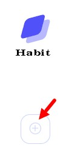
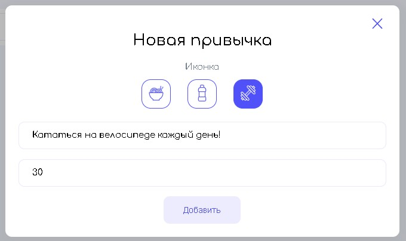
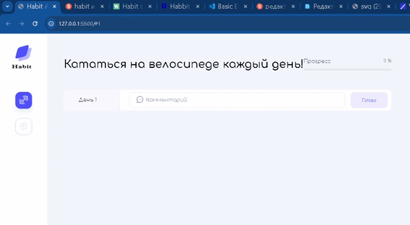
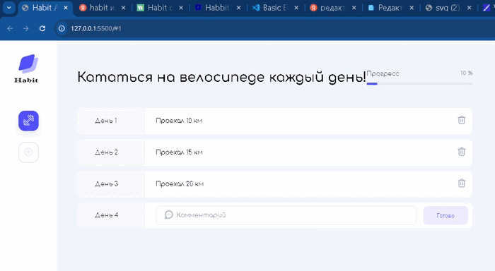

# Трекер привычек

Приложение поможет вам следить за прогресом формирования полезных привычек.

## Работа с приложением

**Добавление привычки.**

При нажатии на кнопку откроется попап: 

## Работа с комментариями

 **Добавить комментарий.**
 

</p
 